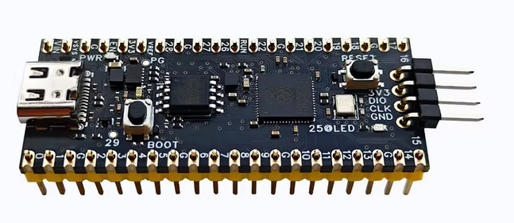
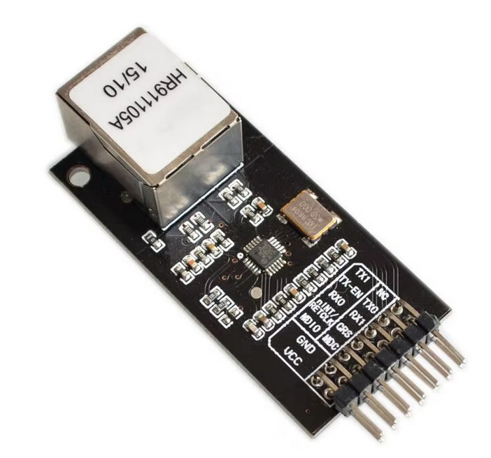
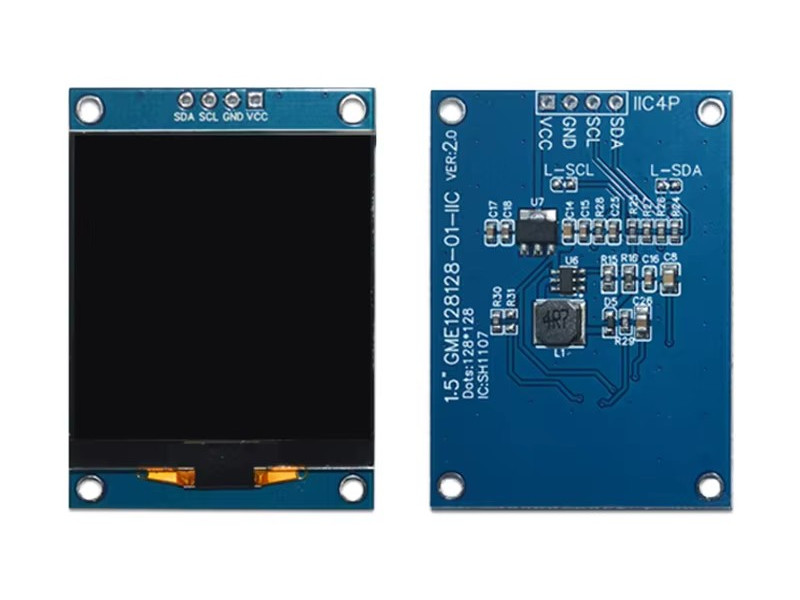

# RP2350 + LAN8720 (RMII) — minimal EtherCAT master (CiA-402 drives)

**▶ Demo video: https://youtu.be/gshzVJQgTCM**

Firmware for an **RP2350 / RP2354A** board that drives a **LAN8720 RMII Ethernet
PHY** straight from the chip's **PIO + DMA** (the RP2350 *is* the MAC) and runs a
small **EtherCAT master** against CiA-402 servo / stepper drives, with a **1.5"
SH1107 OLED** UI in LVGL.

Verified on hardware against a Lichuan **CL3-E57H** closed-loop stepper (vendor
`0x0A79`, product `0x1000`): the drive is discovered, identified over CoE, walked
**INIT → PRE-OP → SAFE-OP → OP**, and driven with a Cyclic-Sync-Position profile.

The LAN8720 is a bare PHY (no MAC), so the Ethernet MAC — framing, CRC32, RMII
signalling at 50 MHz — is implemented in RP2350 **PIO + DMA**, and a small
hand-rolled EtherCAT master runs on top of its raw L2 send/receive.

A pre-built image is in
[`firmware/rp2350_lan8720.uf2`](firmware/rp2350_lan8720.uf2).

---

## What it does

- Implements an **RMII MAC** on the RP2350: two PIO state machines (`src/pio/
  lan8720_{rx,tx}.pio`, after **messani/pico-lan8720**) **edge-synchronised to the
  module's REF_CLK on every di-bit**, plus DMA, sending/receiving raw **EtherCAT**
  frames (EtherType `0x88A4`). 100 Mbit full-duplex. No TCP/IP.
- Runs a small **hand-rolled EtherCAT master** (`src/ethercat.c`): broadcast-read
  discovery, station-address assignment, reads each slave's mailbox layout from
  its **SII (EEPROM)**, and walks the EtherCAT state machine to **OP**.
- Over **CoE / SDO**: reads and decodes the drive **identity** (vendor, model,
  HW/SW version, supported modes), configures the **CiA-402 Cyclic-Sync-Position
  (CSP)** PDO mapping (RxPDO `0x6040`+`0x607A`, TxPDO `0x6041`+`0x6064`) and the
  SyncManagers / FMMUs.
- Runs the **cyclic process-data** loop. Motion is position-based: the master
  computes a non-linear accel/decel **ramp** and integrates it into a streamed
  **target position** (`0x607A`); the drive's position loop follows. Actual
  position (`0x6064`) is read back for a **real** measured-speed readout.
- Shows each drive on the OLED (searching → model name + position → speed while
  running). **Two buttons to GND** drive the motion (hold to run); everything is
  traced over **USB-CDC**.

Stack: **pico-sdk + FreeRTOS (SMP) + LVGL + a PIO RMII MAC**. No SOEM, no lwIP.
Dependencies are fetched into `extern/` on first cmake configure.

> **Scope.** The LAN8720 is not an EtherCAT slave controller — no Distributed
> Clocks — so this is a soft, best-effort master for bench/demo use, not a
> hard-real-time fieldbus.

---

## Hardware

### RP2350 board



A Raspberry Pi **RP2350 / RP2354A** (dual Cortex-M33, 2 MB internal flash). The
EtherCAT fieldbus + RMII MAC run on **core 1**; the OLED UI, buttons and USB log
on **core 0**. The system clock runs at **250 MHz** (clkdiv=1 PIO).

### LAN8720 RMII Ethernet module



A standard **LAN8720A** RMII module with an onboard **50 MHz oscillator**. The
module supplies `REF_CLK` (on its `nINT/RETCLK` pin) and the RP2350 takes it as
an input; the PIO MAC re-syncs to it on every di-bit, so **no module hardware
modification is needed** and the system clock need not be phase-locked to it.

### SH1107 OLED (GME128128, 128×128, I²C)



A 1.5" 128×128 monochrome SH1107 panel over I²C (addr `0x3C`), `src/sh1107.c`.

---

## Wiring

All on **3.3 V**. The RMII bus is 3.3 V signalling.

### LAN8720 → RP2350 (RMII)

| LAN8720 pin | GPIO | Function                                   |
|-------------|------|--------------------------------------------|
| TXD0        | GP10 | PIO TX data 0                              |
| TXD1        | GP11 | PIO TX data 1                              |
| TXEN        | GP12 | PIO TX-enable                              |
| RXD0        | GP6  | PIO RX data 0                              |
| RXD1        | GP7  | PIO RX data 1                              |
| CRS_DV      | GP8  | PIO RX data-valid                          |
| MDIO        | GP14 | PHY management data (bit-bang)             |
| MDC         | GP15 | PHY management clock (bit-bang)            |
| nINT/RETCLK | GP22 | **50 MHz REF_CLK out from the module** (RP2350 input) — the module's clock pin (silk `nINT/RETCLK`) |
| nRST        | 3V3  | tie high if broken out (many of these modules have no RST pin) |
| VCC / GND   | 3V3 / GND |                                       |

> The RMII GPIO numbers are **compiled into** `src/pio/lan8720_rx.pio` (the PIO
> assembler needs them; `lan8720_tx.pio` re-declares REF_CLK). `src/board.h`
> mirrors them. TXD0/1/EN must stay consecutive, and so must RXD0/1/CRS_DV.
> REF_CLK is fixed to GP22 in both `.pio` files.

LAN8720 RJ45 → drive **ECAT IN** (chain: master → drive IN → …).

### SH1107 OLED (I2C0) + buttons

| Item               | Pins              | Notes                         |
|--------------------|-------------------|-------------------------------|
| OLED SDA / SCL     | GP4 / GP5         | I2C0                          |
| Button — Servo run | GP2 → GND         | active-low (internal pull-up) |
| Button — Step run  | GP3 → GND         | active-low (internal pull-up) |

Pins and EtherCAT settings (target rpm, ramp times, counts/rev, product codes)
are in [`src/board.h`](src/board.h) (`EC_*`). If the OLED stays blank, try I²C
address `0x3D` (`OLED_I2C_ADDR`).

---

## Build & flash

Prerequisites: `cmake`, `make`, `arm-none-eabi-gcc`, `git`, `tio`, and libusb dev
headers (for picotool).

```bash
mkdir build && cd build
cmake ..                 # fetches pico-sdk, FreeRTOS, LVGL, pico-lan8720, picotool into ../extern
make flash monitor       # build, flash via picotool (USB), then open the serial log
```

`make` targets (run from `build/`): `make` (build), `make flash` (build + flash
over USB via the vendored picotool), `make monitor` (serial log via `tio` on
`/dev/ttyACM0`), `make reboot`. Or drag
[`firmware/rp2350_lan8720.uf2`](firmware/rp2350_lan8720.uf2) onto the BOOTSEL
drive.

---

## Serial / USB log

Logged over **USB-CDC** via an async logger (`src/log.c`); open with
`make monitor`. A healthy boot looks like:

```
[MAC] PHY @addr 1 ID=0x0007C0F1
[MAC] *** LINK UP *** (BMSR=0x782D)
[EC] === segment scan: BRD WKC=1 (slaves answering) ===
[EC] sta 0x1001 identity: Vendor=0x0A79 Product=0x1000 ... 'ECAT-DR'  => StepDrive
[EC]   Product code = 0x1000  CL3-E57H
[EC] sta 0x1001 PDO map (CSP) configured
[EC] sta 0x1001 -> SAFE-OP ok ... reached OP
[EC] sta 0x1001 OP SW=0x1637 pos=0 vel=0rpm tgt=0 wkc=1
```

`BRD WKC` = number of slaves answering; `wkc` on the cyclic line should equal the
slave count. Verbose tracing is gated by `NET_DEBUG_ENABLE` in `src/board.h`.

If `NO PHY on MDIO`: check MDIO/MDC wiring, module power, and REF_CLK on GP22. If
the link won't come up, check the cable and the RXD/TXD/CRS_DV wiring.

---

## Using it

1. After boot each window shows **searching** until the drive is found.
2. Once up, the window shows the **model name** (e.g. `CL3-E57H`) and the live
   **position** in revolutions.
3. **Hold GP2 (Servo) / GP3 (Step)** to GND: the window shows the **speed**, the
   motor ramps up (~5 s to max), the position counts up; **release** to ramp
   smoothly back to a stop.

For an autonomous bench test (no buttons), set `EC_AUTORUN` in `src/board.h`.

---

## Notes / robustness

- The firmware **self-recovers** from faults: a hard fault or stack overflow
  records the cause and reboots via the watchdog (reported on the next boot as
  `*** previous run crashed: … ***`); a full lockup is caught by a hardware
  watchdog fed from the display task. The board never needs a manual reset.
- **Why edge-synced TX matters:** a free-running PIO TX (the pico-rmii-ethernet
  approach) only re-syncs to REF_CLK once per frame; against the module's
  independent 50 MHz oscillator its phase drifts and the PHY rejects the frames.
  Re-syncing every di-bit (messani's approach) fixes it without phase-locking the
  system clock — which is why no module modification is required.

---

## Layout

```
src/
  main.c            boot + clock/voltage + watchdog + FreeRTOS task launch
  board.h           pin map + EtherCAT config (EC_*) + SYS_CLOCK_KHZ
  shared_state.*    mutex-guarded per-drive state shared between tasks
  rmii_mac.*        LAN8720 RMII MAC on PIO+DMA (raw send/recv, MDIO, link)
  pio/lan8720_*.pio RMII TX/RX PIO (edge-synced to REF_CLK; pin map)
  lan8720a.h        LAN8720 MII register map
  ethercat.*        hand-rolled EtherCAT master + CoE/SDO + CiA-402 CSP (core 1)
  sh1107.*          SH1107 128x128 I2C OLED driver
  display_task.*    LVGL UI + button polling + watchdog feed (core 0)
  periph.*          I2C bus + the two run buttons
boards/             RP2350 board header (rp2350_lan8720_board.h)
extern/             fetched deps: pico-sdk, FreeRTOS, LVGL, pico-lan8720, picotool
firmware/           pre-built UF2
```

## Credits

The PIO RMII MAC builds directly on prior Pico-RMII work (lwIP layer removed):

- [**messani/pico-lan8720**](https://github.com/messani/pico-lan8720) — the
  edge-synchronised TX/RX that makes 100 Mbit work on an unmodified module; the
  shipping `src/pio/lan8720_*.pio` are adapted from it.
- [**rscott2049/pico-rmii-ethernet_nce**](https://github.com/rscott2049/pico-rmii-ethernet_nce)
  — the "Neon Chrome Edition" of pico-rmii-ethernet that fixed 100 Mbit TX and
  added DMA-ring / external-clock support; used throughout the bring-up and the
  basis of the first MAC iteration.
- [**sandeepmistry/pico-rmii-ethernet**](https://github.com/sandeepmistry/pico-rmii-ethernet)
  — the original Pico RMII Ethernet library both of the above derive from.
